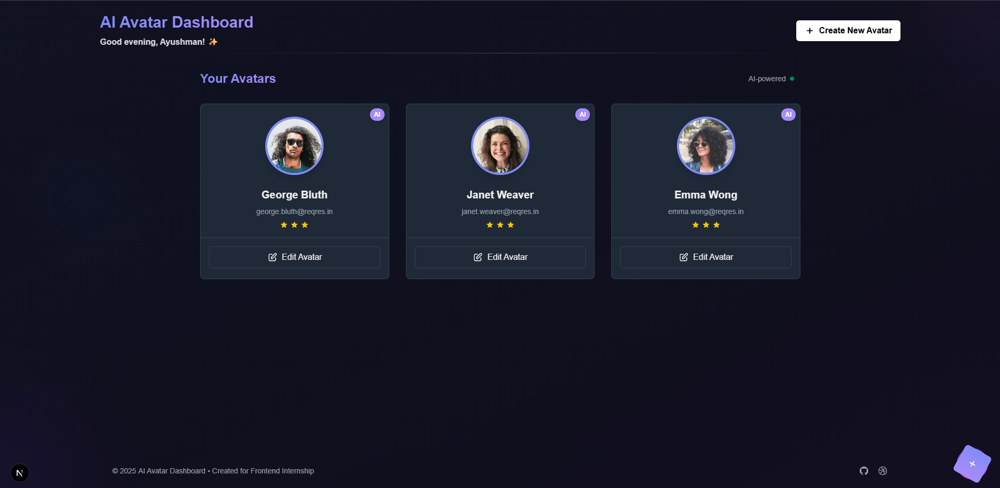

# AI Avatar Dashboard

A modern, interactive dashboard for managing AI-generated avatars built with Next.js and Tailwind CSS. Features include 3D tilt effects, dynamic lighting, search functionality, dark/light mode, and interactive animations for a seamless user experience.



## ✨ Features

- **Interactive Avatar Cards**: Beautiful cards with tilt effects and dynamic lighting
- **Smooth Animations**: Consistent animations and transitions throughout the UI
- **Responsive Design**: Fully responsive layout that works on all device sizes
- **Dark Mode Support**: Seamless toggle between light and dark themes
- **Search Functionality**: Easily find avatars by name or email
- **Create & Edit Avatars**: Modal interface for avatar management
- **Confetti Effects**: Celebrate when creating new avatars
- **Real-time Data**: Fetch avatars from Reqres API

## 🛠️ Technologies

- **Next.js** - React framework for building performant web applications
- **TypeScript** - Type safety and better developer experience
- **Tailwind CSS** - Utility-first CSS framework for rapid UI development
- **React Hooks** - Functional component state management
- **Modern Animation Techniques** - Using CSS animations and transitions
- **Reqres API** - REST API with dummy data for testing

## 🚀 Getting Started

### Prerequisites

- Node.js (v14 or later)
- npm or yarn

### Installation

1. Clone the repository
```bash
git clone https://github.com/Ayushmanonlycode/ai-dashboard.git
cd ai-dashboard
```

2. Install dependencies
```bash
npm install
# or
yarn install
```

3. Run the development server
```bash
npm run dev
# or
yarn dev
```

4. Open [http://localhost:3000](http://localhost:3000) in your browser

## 📁 Project Structure

```
ai-dashboard/
├── public/
├── src/
│   ├── app/
│   │   ├── page.tsx      # Main dashboard page
│   │   ├── layout.tsx    # Root layout
│   │   ├── providers.tsx # Client-side providers
│   │   └── globals.css   # Global styles
│   ├── components/
│   │   ├── Avatar.tsx    # Avatar card component
│   │   ├── CreateAvatarModal.tsx  # Modal for creating new avatars
│   │   └── ui/           # Reusable UI components
│   │       ├── Button.tsx
│   │       ├── Card.tsx
│   │       ├── Modal.tsx
│   │       ├── Search.tsx
│   │       └── TypeWriter.tsx
│   └── lib/
│       └── api.ts        # API service for fetching data
├── package.json
└── README.md
```

## 📷 Screenshots

### Light Mode


### Avatar Creation


## 📝 License

This project is licensed under the MIT License - see the [LICENSE](LICENSE) file for details.

## 🙏 Acknowledgements

- [Reqres.in](https://reqres.in) for the avatar API
- [Heroicons](https://heroicons.com/) for the beautiful icons

## 👤 Author

Created with ❤️ for Frontend Internship
